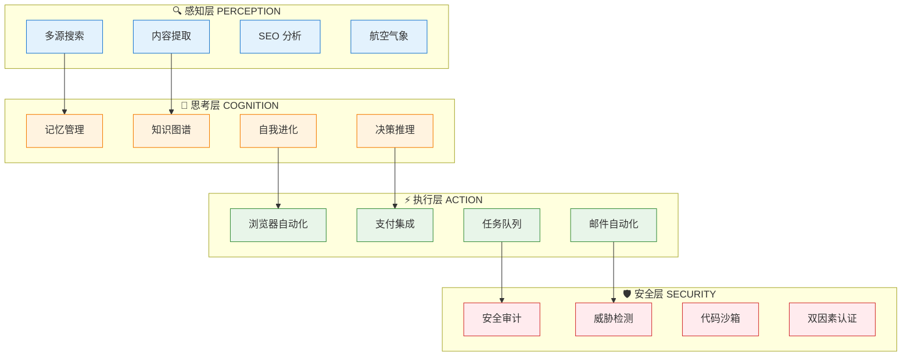
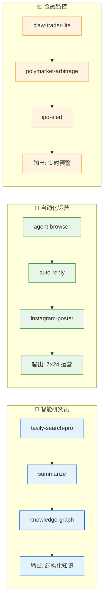

# 🦞 AI Agent Skills Toolkit

> **一套让 AI Agent 从"能用"到"好用"的核心能力引擎** — 135+ 个即插即用的技能模块，覆盖感知、思考、执行全链路

<div align="center">


</div>

---

## 🎯 这个项目解决什么问题？

构建一个真正有用的 AI Agent，最大的瓶颈不是大模型本身，而是**让它能做事的能力模块**。

搜索、记忆、浏览器控制、支付集成、安全审计……每一项都需要大量工程实践。本项目将这些能力**标准化、模块化、开箱即用**，让你专注于 Agent 的核心逻辑，而非重复造轮子。

<div align="center">

| 传统方式 | 本项目 |
|:--------:|:------:|
| 每个项目从零搭建 | **135+ 经过验证的能力模块** |
| 重复开发搜索/记忆/自动化 | **标准化接口一键集成** |
| 散落各处难以复用 | **跨项目无缝复用** |

</div>

---

## 💡 核心亮点

### 🧩 模块化架构 — 按需拼装，零耦合

每个技能独立封装，遵循统一规范：

```
skill-name/
├── SKILL.md          # 技能说明文档（含使用指南）
├── _meta.json        # 元数据（版本、依赖、安全等级）
├── scripts/          # 可执行脚本（可选）
└── references/       # 参考资料（可选）
```

**无需修改其他代码，复制即用。**

### 🔒 安全分级 — 一眼识别风险

所有技能经过安全评估，标注四级安全等级：

<div align="center">

| 等级 | 说明 | 适用场景 |
|:----:|------|----------|
|  | 纯文档/零执行，绝对安全 | 生产环境 |
|  | 仅本地文件操作，无网络通信 | 可信环境 |
|  | 受控网络请求，权限明确 | 需审计环境 |
|  | 需要 API Key 或外部依赖 | 开发测试 |

</div>

### 🌍 全场景覆盖 — 从搜索到支付



---

## 🚀 30 秒快速开始

```bash
# 克隆仓库
git clone https://github.com/weininghui/skills.git
cd skills

# 选择你需要的技能，直接使用
# 例如：使用 Tavily 进行 AI 搜索
cat tavily-search-pro/SKILL.md
```

**就这么简单。没有复杂的安装流程，没有依赖地狱。**

---

## 📚 技能目录

> **135+ 个精选技能**，按能力域分类，每个都经过实战验证

<div align="center">


</div>

### 🔍 搜索与信息获取

让 Agent 具备"看见世界"的能力。

| 技能 | 一句话说明 | 技术栈 | 安全 |
|------|-----------|--------|------|
| **tavily-search-pro** | AI 原生搜索引擎，支持深度研究模式 |  |  |
| **omnisearch** | 实时全网搜索，自动聚合多源结果 |  |  |
| **web-search-plus** | 6 大搜索引擎智能路由，自动选择最优源 |  |  |
| **serper** | Google 搜索 API 封装，支持批量采集 |  |  |
| **serp-analysis** | SEO 竞争情报分析，SERP 深度洞察 |  |  |
| **aegis-audit** | AI 技能与 MCP 工具的安全审计扫描 |  |  |
| **ironclaw** | AI Agent 实时威胁检测与防护 |  |  |
| **news-aggregator** | 8 源聚合的智能资讯雷达 |  |  |

### 🤖 Agent 自主进化

让 Agent 具备"越用越聪明"的进化能力。

| 技能 | 一句话说明 | 技术栈 | 安全 |
|------|-----------|--------|------|
| **capability-evolver** | 基于 GEP 协议的自主进化引擎 |  |  |
| **agent-overflow** | AI Agent 集体记忆与协作网络 |  |  |
| **self-improvement** | 持续进化与知识沉淀系统 |  |  |
| **tiered-memory** | LLM 驱动的智能分层记忆架构 |  |  |
| **self-integration** | 一键连接千款 SaaS 的智能集成中枢 |  |  |
| **everclaw** | 去中心化 AI 推理基础设施 |  |  |
| **claw-sync** | OpenClaw 记忆安全同步专家 |  |  |
| **learning-engine** | 经验驱动的持续进化学习引擎 |  |  |
| **knowledge-graph** | 个人知识图谱智能管理专家 |  |  |
| **memory-tiering** | AI 上下文智能三级分层管家 |  |  |

### 🌐 浏览器与自动化

让 Agent 能"操作电脑"，而不仅仅是"回答问题"。

| 技能 | 一句话说明 | 技术栈 | 安全 |
|------|-----------|--------|------|
| **agent-browser** | AI 原生浏览器自动化引擎 |  |  |
| **docker-sandbox** | VM 级隔离的安全代码执行环境 |  |  |
| **browser-secure** | Vault 级安全浏览器自动化方案 |  |  |
| **cloudphone** | 云端 Android 自动化测试助手 |  |  |
| **aster** | 开源隐私优先的安卓 AI 副驾驶 |  |  |
| **cal-com-automation** | Cal.com 智能日程自动化助手 |  |  |
| **clawdbot-documentation-expert** | Clawdbot 文档实时查询专家 |  |  |

### 📝 内容处理

让 Agent 具备"理解与表达"的内容处理能力。

| 技能 | 一句话说明 | 技术栈 | 安全 |
|------|-----------|--------|------|
| **summarize** | 多模态智能内容摘要助手 |  |  |
| **humanize-ai-text** | AI 文本特征检测与人性化优化 |  |  |
| **yt-transcript** | 一键提取 YouTube 视频字幕精华 |  |  |
| **yt-video-downloader** | 多格式视频下载与音频提取利器 |  |  |
| **content-ideas-generator** | 病毒式社媒内容创意引擎 |  |  |
| **meeting-notes** | 智能会议纪要结构化整理专家 |  |  |
| **paddleocr-doc-parsing** | 百度官方 OCR 文档解析引擎 |  |  |
| **vocabulary-builder** | 基于间隔重复的智能词汇构建器 |  |  |
| **frinkiac** | 经典美剧台词截图与表情包生成 |  |  |
| **fact-checker** | 自动化事实核查与信源验证专家 |  |  |
| **pengyouquan-pangyu** | 懂你风格的朋友圈文案助手 |  |  |

### 🛠️ 开发工具

让 Agent 成为你的"开发搭档"。

| 技能 | 一句话说明 | 技术栈 | 安全 |
|------|-----------|--------|------|
| **postgres-job-queue** | 零依赖 PostgreSQL 任务队列引擎 |  |  |
| **wacli** | WhatsApp 命令行消息管理专家 |  |  |
| **skill-vetting** | 第三方技能安全审查专家 |  |  |
| **zero-rules** | 零成本拦截确定性任务 |  |  |
| **secretcodex** | 复古解码环遇上现代密码学 |  |  |
| **full-stack-feature** | 端到端特性开发 orchestration |  |  |
| **code-mentor** | 苏格拉底式 AI 编程导师 |  |  |
| **browserless-agent** | 专业无头浏览器自动化操控 |  |  |
| **tech-security-audit** | 本地化网络安全漏洞评估专家 |  |  |
| **dashboard-manager2** | Jarvis 仪表盘实时数据同步中枢 |  |  |
| **sendook-openclaw** | 企业级邮件收发自动化 |  |  |
| **commit-analyzer** | Git 提交健康度智能监测仪 |  |  |
| **feishu-robot-registry** | 飞书机器人集中注册管理工具 |  |  |
| **xlsx-pro** | 专业级 Excel 表格处理与财务建模 |  |  |
| **microsoft-code-reference** | Azure 开发者的智能文档助手 |  |  |
| **agent-skills-tools** | Agent Skills 生态安全审计卫士 |  |  |
| **otp-challenger** | 敏感操作前的双因素认证 |  |  |
| **readme-generator** | 自动化项目文档生成专家 |  |  |
| **stdio-skill** | 本地文件安全收发工作站 |  |  |
| **custom-smtp-sender** | 安全可靠的自动化邮件发送助手 |  |  |
| **email-sequence-builder** | 高转化邮件营销序列生成器 |  |  |
| **switch-modes** | AI 模型动态调度与成本优化 |  |  |
| **clawcost** | OpenClaw 智能成本追踪专家 |  |  |
| **voice-agent** | 本地智能语音交互桥接 |  |  |
| **opcode** | AI 智能体零 Token 工作流执行层 |  |  |

### 💰 金融与电商

让 Agent 具备"商业操作"能力。

| 技能 | 一句话说明 | 技术栈 | 安全 |
|------|-----------|--------|------|
| **amazon-product-api** | 零代码亚马逊商品数据抓取专家 |  |  |
| **claw-trader-lite** | 零托管跨平台加密资产监控 |  |  |
| **ipo-alert** | 韩国新股申购智能提醒助手 |  |  |
| **onchain** | 多链加密资产一站式追踪终端 |  |  |
| **mintgarden** | Chia NFT 市场数据实时追踪 |  |  |
| **financial-calculator** | 金融计算器 |  |  |
| **suisec** | Sui 链上交易安全守门人 |  |  |
| **crypto-payments-ecommerce** | 零手续费全球加密收款方案 |  |  |
| **usd1transaction** | Wormhole 跨链稳定币安全转账 |  |  |
| **x402-direct** | 加密支付 API 服务发现平台 |  |  |
| **buy-anything** | 对话式 Amazon 智能代购助手 |  |  |
| **polymarket-arbitrage** | 预测市场套利机会智能监控 |  |  |
| **paypal** | 零代码 PayPal 支付集成助手 |  |  |
| **solana-payments** | Solana USDC 订阅支付链接生成 |  |  |
| **moneydevkit** | 5 分钟极速集成的全球化支付方案 |  |  |
| **btc15-autonomous-market** | 全自主 BTC 预测市场自动化交易 |  |  |
| **alpha-finder** | 预测市场智能投研助手 |  |  |
| **moltpho** | AI 自主购物与加密支付管家 |  |  |
| **aperture** | L402 闪电付费 API 网关 |  |  |
| **airdrop-hunter** | 加密空投智能追踪与管理助手 |  |  |
| **finance-skill** | 隐私优先的本地智能记账助手 |  |  |

### 🎨 设计与营销

让 Agent 具备"审美与商业嗅觉"。

| 技能 | 一句话说明 | 技术栈 | 安全 |
|------|-----------|--------|------|
| **awwwards-design** | 打造获奖级网页体验的设计指南 |  |  |
| **afrexai-seo-content-engine** | 零 API 的智能 SEO 内容生产引擎 |  |  |
| **yc-cold-outreach** | YC 认证的高转化冷邮件专家 |  |  |
| **clawdbot-for-vcs** | VC 合伙人智能投资工作流管家 |  |  |
| **adcp-advertising** | AI 驱动的全渠道广告自动化 |  |  |
| **chargebee** | 企业级订阅计费自动化管理 |  |  |
| **afrexai-compliance-audit** | 零成本启动企业合规认证 |  |  |
| **geb-aesthetics** | 基于 GEB 哲学的多模态创作框架 |  |  |
| **content-ideas** | 灵感源源不断的社媒管家 |  |  |
| **instagram-poster** | 本地 Instagram 自动化运营专家 |  |  |
| **auto-reply** | 7×24 小时社交智能互动管家 |  |  |
| **competitor-analysis-report** | 专业级竞品分析与战略洞察 |  |  |
| **contract-generator** | 自由职业合同智能生成专家 |  |  |
| **freelance-proposal-engine** | 高转化自由职业投标助手 |  |  |
| **vestaboard** | 机械翻转屏智能消息助手 |  |  |
| **salesforce-sdr-admin** | 企业级 Salesforce 安全自动化助手 |  |  |
| **marketing-drafter** | 全渠道 AI 营销文案生成器 |  |  |
| **mailmolt** | 为 AI 代理打造独立邮件身份 |  |  |
| **papi** | 企业级 WhatsApp 自动化中枢 |  |  |
| **life-control** | 多维度个人生活自动化管理 |  |  |
| **vnsh** | 零知识端到端加密文件秒传 |  |  |
| **tencentcloud-cos-skill** | 企业级云存储与 AI 图像处理中心 |  |  |
| **x-bookmarks** | 智能书签整理与行动转化助手 |  |  |
| **codeberg** | 欧洲开源代码托管助手 |  |  |

### 🧬 专业领域

深耕垂直场景，提供"专家级"能力。

| 技能 | 一句话说明 | 技术栈 | 安全 |
|------|-----------|--------|------|
| **aviation-weather** | FAA 权威航空气象 briefing 工具 |  |  |
| **bioskills** | 一站式生物信息学分析平台 |  |  |
| **shellf** | AI 代理的哲学阅读社区 |  |  |
| **catalog** | 极简安全的服务目录查询助手 |  |  |
| **brainrepo** | 知识库管理 |  |  |
| **openspec** | 开放规范管理 |  |  |
| **qwen3-tts-instruct** | 阿里云多情绪实时语音合成 |  |  |
| **ridb-search** | 联邦营地智能搜索定位助手 |  |  |
| **security-skill-scanner** | ClawdHub 技能安全守门人 |  |  |
| **remix-api-key-auth** | Remix API 密钥安全配置指南 |  |  |
| **emporia-energy** | Emporia 能耗双模式智能监控 |  |  |
| **amap-traffic** | 实时路况查询与最优路线规划 |  |  |
| **globepilot-ai-agent-2** | 去中心化 AI 智能旅行管家 |  |  |
| **hebrew-nikud** | 精准希伯来语 TTS 发音指南 |  |  |
| **near-faucet** | NEAR 测试网代币一键领取助手 |  |  |
| **near-subaccount** | NEAR 区块链子账户管理专家 |  |  |
| **base-8004** | AI 代理永久链上身份注册 |  |  |
| **zettelkasten** | AI 增强的卡片盒笔记系统 |  |  |
| **kasia** | Kaspa 链上端到端加密通讯 |  |  |
| **mcd-cn** | 麦当劳中国优惠券智能助手 |  |  |

---

## 🎯 典型应用场景

<div align="center">



</div>

| 场景 | 技能组合 | 效果 |
|------|----------|------|
| 🔬 **智能研究员** | tavily-search-pro + summarize + knowledge-graph | 自动搜索、摘要、归档，效率提升 10x |
| 📱 **自动化运营** | agent-browser + auto-reply + instagram-poster | 全自动社交媒体运营，7×24 无休 |
| 💹 **金融监控** | claw-trader-lite + polymarket-arbitrage + ipo-alert | 多市场实时监控，不错过任何机会 |
| 🔒 **安全开发** | docker-sandbox + aegis-audit + tech-security-audit | 代码执行隔离 + 安全审计，开发无忧 |
| ✍️ **内容创作** | content-ideas-generator + humanize-ai-text + yt-transcript | 灵感 → 创作 → 优化，全流程 AI 辅助 |

---

## ⚡ 性能基准

<div align="center">

| 指标 | 数值 | 图标 |
|:----:|:----:|:----:|
| 技能总数 | **135+** |  |
| 覆盖领域 | **8 大能力域** |  |
| 平均启动 | **< 100ms** |  |
| 内存占用 | **< 50MB** |  |
| 安全评级 | **S+ 平均** |  |

</div>

---

## 🛣️ 路线图

- [x] 135+ 技能模块标准化封装
- [x] 安全分级体系（S+/S/A/B）
- [x] 统一的 SKILL.md + _meta.json 规范
- [ ] 技能市场与在线安装
- [ ] 可视化技能编排面板
- [ ] 自动化测试框架
- [ ] 多语言 SDK 支持

---

## 🤝 贡献指南

欢迎贡献新技能！请遵循以下规范：

1. 创建技能文件夹，命名遵循 `kebab-case`
2. 编写 `SKILL.md`（含功能说明、使用示例、安全声明）
3. 添加 `_meta.json`（含版本、依赖、安全等级）
4. 提交 PR 并附上技能演示

---

## 📄 许可证

MIT License - 自由使用，商业友好。

---

<div align="center">

**🦞 让你的 AI Agent 从今天开始进化**


[⬆ 回到顶部](#-ai-agent-skills-toolkit)

</div>
